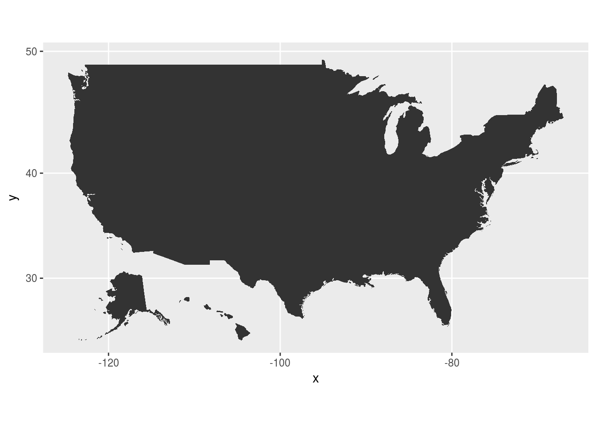
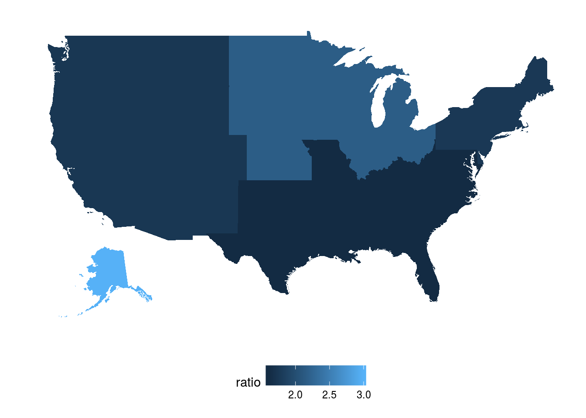
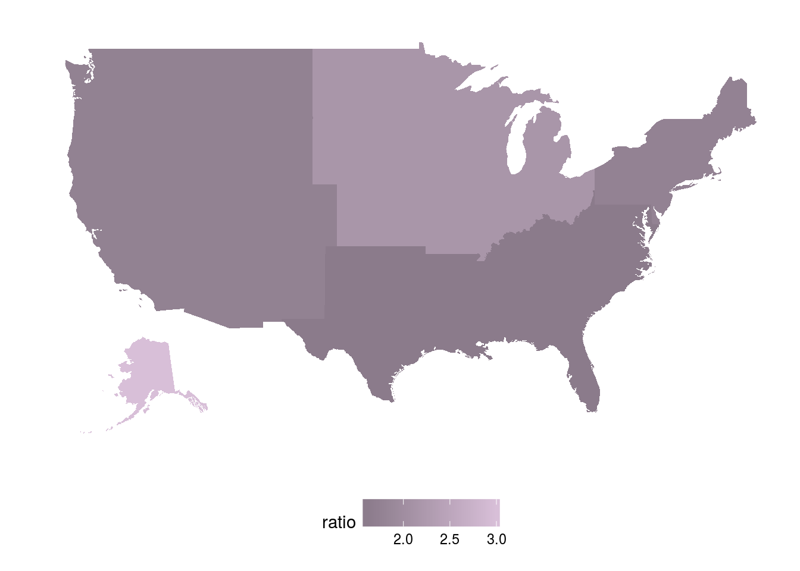

# Map Visualizations {#topics-map-viz}


## Background
This is a quick intro to plotting data over a map in R. For this exercise, we'll look at an old trending topic on social media -- Yanny vs. Laurel.

As a quick background story: In May of 2018, a [post](https://twitter.com/CloeCouture/status/996218489831473152?ref_src=twsrc%5Etfw%7Ctwcamp%5Etweetembed%7Ctwterm%5E996218489831473152&ref_url=http%3A%2F%2Ftime.com%2F5279727%2Fyanny-laurel-original-clip%2F) about a short audio clip which sounded like the word "laurel" to some listeners and "yanny" to others was widely shared (and debated) on social media. The audio clip itself sounds like a poor representation of (English language) pronunciation of both "laurel" and "yanny", and is rather something in between the two. People sometimes distinctly heard one or the other -- either "laurel" or "yanny" but not the other. When linguist Chelsea Sanker commented on the Laurel/Yanny phenomenon, she suggested that your [regional dialect](https://www.theatlantic.com/technology/archive/2018/05/dont-rest-on-your-laurels/560483/) might have an influence on which one you percieved, and that [more demographic information](http://conf.ling.cornell.edu/cas443/Sanker_PosterLaurelYanny2018.pdf) would be useful in considering this possibility.

In this exercise, we will perform an exploratory analysis of Yanny vs. Laurel by geographic region by plotting a dataset of tweets about the topic over a map of the United States.

37,064 unique tweets containing the word "yanny" or the word "laurel" (or both) were gathered via the Twitter API using the <a href="https://cran.r-project.org/web/packages/twitteR/twitteR.pdf">twitteR</a> package. These tweets included retweets, since it was assumed that retweeting also signified contributing an opinion to the debate. From these tweets, the Twitter API was used again to retrieve the location information (if any) listed in the bio of each relevent accounts. It is beyond the scope of this little tutorial to go into that part of the analysis, so we from this point forward we will just start with resulting dataset. If you're interested in using the Twitter API, you should! There is documentation on the <a href="https://developer.twitter.com/en/docs.html">Twitter website</a> and <a href="https://medium.com/@GalarnykMichael/accessing-data-from-twitter-api-using-r-part1-b387a1c7d3e">tutorials</a> on how to do this in the R language.

After gathering the data, a "winner"" was calculated, by tweet, by tallying "laurel" mentions vs. "yanny" mentions and taking the highest tally. This winner formed the metric of a speaker's choice. This approach assumed that a speaker would mention more often the form that they prefer -- for example:

- "When I say yanny... do you hear laurel?" - Coworker. Bruhhhh what? #laurel (Laurel wins!)

- This may cause divorce. My husband hears it wrong. #Laurel https://t.co/FTmCsZoY8i (Laurel!)

- Transervice is team Yanny... what about you Yanny or Laurel, what do you hear? https://t.co/lxG6p8g01I  (Yanny wins!)

- I stg this is causing a war in my family.  3/5 hear #yanny while 2/5 hears #laurel I'm 100% team Yanny https://t.co/PG7twEhLbB  (Yanny!)

- RT @LoriLoughlin: I hear Yanny. #yannyvslaurel #Yanny https://t.co/fUo9jDDqhp  (Yanny again!)

Under this metric, some speakers were "ties" and so they won't contribute to the analysis -- for example, this one:

- Brands tryna capitalize on #Yanny and #Laurel https://t.co/gz74Mwb6SX  (Nobody wins)

If a user tweeted multiple times on the subject, only their first tweet with a "win" was counted.

The user location data gathered via the Twitter API was then transformed from its raw form to a a U.S. state location. For example, if a user's bio location contained either "California" or "CA",their full state name was coded as "California." This means non-U.S. regions and ambiguous regions or misspellings were skipped over, and users who chose not to provide a location were also skipped. This brought the sample size down to 6,499 tweets with U.S. state locations.

The result was then merged with a set of of states, census regions, and larger regions compiled from information provided by <a href="https://www2.census.gov/geo/pdfs/maps-data/maps/reference/us_regdiv.pdf">U.S. Census</a>.

Plotting by state or census region acts as a rough proxy for dialect. Dialects may not align perfectly with state or region boundaries -- e.g. a state or a city could contain many dialects. But since all we have to go on is Twitter bios, we won't get perfect alignment with dialectal boundaries. This is a rough approximation that can be nice for an exploratory analysis.

That's all the background info, so let's load the data and get into the map-making!

`dataset` contains the Twitter data with the Cenusus information included, and `state` contains the Census information by itself.


```r
dataset <- read.csv("data/anonymizedDedupedDataset.csv", stringsAsFactors = FALSE)
states <- read.csv("data/states.csv", stringsAsFactors = FALSE)
```

## How Maps Work
When you plot a map using R, you generally need two things: a shape to map over (representing the geographic areas and boundaries) and a dataset including location.

Currently, our Twitter dataset has the following variables:


```
#>  [1] "text"          "favorited"     "favoriteCount" "replyToSN"    
#>  [5] "created"       "truncated"     "replyToSID"    "id"           
#>  [9] "replyToUID"    "statusSource"  "screenName"    "retweetCount" 
#> [13] "isRetweet"     "retweeted"     "longitude"     "latitude"     
#> [17] "location"      "State"         "Abbreviation"  "CensusRegion" 
#> [21] "LargerRegion"  "laurelCount"   "yannyCount"    "choice"
```

and the state, state abbreviation, cencuses, and larger region variables look like this:

<table class="table table-striped" style="margin-left: auto; margin-right: auto;">
 <thead>
  <tr>
   <th style="text-align:left;"> State </th>
   <th style="text-align:left;"> Abbreviation </th>
   <th style="text-align:left;"> CensusRegion </th>
   <th style="text-align:left;"> LargerRegion </th>
  </tr>
 </thead>
<tbody>
  <tr>
   <td style="text-align:left;"> washington </td>
   <td style="text-align:left;"> WA </td>
   <td style="text-align:left;"> Pacific </td>
   <td style="text-align:left;"> West </td>
  </tr>
</tbody>
</table>

<br/>
Plotting a map geom requires the ggplot2 package, and the map we would like to plot over can be found in the <a href="https://cran.r-project.org/web/packages/fiftystater/index.html">fiftystater</a> package. That makes our task a little easier, because `fiftystater` already contains the lognitude and latitude coordinates for plotting a map. All that remains is to match the Twitter dataset back to `fiftystater` by means of the identifying variable, U.S. state name. 

As an example, let's plot a map right now just using `fiftystater`. It won't have the Twitter data in it yet, but that's alright. Once the `fiftystater` package is loaded, you can look at the data frame `fifty_states` to see what you're working with.  `fiftystater`'s `fiftystates` data:

<table class="table table-striped" style="margin-left: auto; margin-right: auto;">
 <thead>
  <tr>
   <th style="text-align:right;"> long </th>
   <th style="text-align:right;"> lat </th>
   <th style="text-align:right;"> order </th>
   <th style="text-align:left;"> hole </th>
   <th style="text-align:left;"> piece </th>
   <th style="text-align:left;"> id </th>
   <th style="text-align:left;"> group </th>
  </tr>
 </thead>
<tbody>
  <tr>
   <td style="text-align:right;"> -85.07007 </td>
   <td style="text-align:right;"> 31.98070 </td>
   <td style="text-align:right;"> 1 </td>
   <td style="text-align:left;"> FALSE </td>
   <td style="text-align:left;"> 1 </td>
   <td style="text-align:left;"> alabama </td>
   <td style="text-align:left;"> Alabama.1 </td>
  </tr>
  <tr>
   <td style="text-align:right;"> -85.11515 </td>
   <td style="text-align:right;"> 31.90742 </td>
   <td style="text-align:right;"> 2 </td>
   <td style="text-align:left;"> FALSE </td>
   <td style="text-align:left;"> 1 </td>
   <td style="text-align:left;"> alabama </td>
   <td style="text-align:left;"> Alabama.1 </td>
  </tr>
  <tr>
   <td style="text-align:right;"> -85.13557 </td>
   <td style="text-align:right;"> 31.85488 </td>
   <td style="text-align:right;"> 3 </td>
   <td style="text-align:left;"> FALSE </td>
   <td style="text-align:left;"> 1 </td>
   <td style="text-align:left;"> alabama </td>
   <td style="text-align:left;"> Alabama.1 </td>
  </tr>
  <tr>
   <td style="text-align:right;"> -85.13156 </td>
   <td style="text-align:right;"> 31.78381 </td>
   <td style="text-align:right;"> 4 </td>
   <td style="text-align:left;"> FALSE </td>
   <td style="text-align:left;"> 1 </td>
   <td style="text-align:left;"> alabama </td>
   <td style="text-align:left;"> Alabama.1 </td>
  </tr>
  <tr>
   <td style="text-align:right;"> -85.13017 </td>
   <td style="text-align:right;"> 31.77885 </td>
   <td style="text-align:right;"> 5 </td>
   <td style="text-align:left;"> FALSE </td>
   <td style="text-align:left;"> 1 </td>
   <td style="text-align:left;"> alabama </td>
   <td style="text-align:left;"> Alabama.1 </td>
  </tr>
  <tr>
   <td style="text-align:right;"> -85.11529 </td>
   <td style="text-align:right;"> 31.73157 </td>
   <td style="text-align:right;"> 6 </td>
   <td style="text-align:left;"> FALSE </td>
   <td style="text-align:left;"> 1 </td>
   <td style="text-align:left;"> alabama </td>
   <td style="text-align:left;"> Alabama.1 </td>
  </tr>
</tbody>
</table>

<br/>
If we want to plot that map, all we have to do is call ggplot with geom_map on the dataset. You might notice that we also include expand_limits and coord_map. That's just to make sure that the plot includes the whole picture, and that the gridlines are appropriate for a map.


```r
ggplot(fifty_states, aes(map_id=id)) + 
        geom_map(map = fifty_states) + 
        expand_limits(x = fifty_states$long, y = fifty_states$lat) +
        coord_map()
```



Hmmm. We probably don't want those axis labels, so let's remove them. While we're at it, let's also remove the gridlines by changing the theme.


```r
ggplot(fifty_states, aes(map_id=id)) + 
        geom_map(map = fifty_states) + 
        expand_limits(x = fifty_states$long, y = fifty_states$lat) +
        coord_map() +
        scale_x_continuous(breaks = NULL) + 
       scale_y_continuous(breaks = NULL) +
       labs(x = "", y = "") +
       theme(panel.background = element_blank())
```


Congratulations! You've made a map!

## Plotting Data Over a Map
Now we just need to plot the Laurel and Yanny data over the map. Each row of data (each tweet) already has a code for whether "Yanny" or "Laurel" won. To find out how this trended over regions, we can just plot within-region ratios of Laurel:Yanny wins. A ratio above 1 indicates a region trended toward Laurel, and a ratio below 1 indicates a region trended toward Yanny.

First, let's plot all U.S. larger regions. Multiple census regions make up a single larger region, so these regions span large parts of the U.S. map.

We need to reformat our Twitter dataset into a summary dataset where each row represents not a single tweet, but rather a single state. Each row of that dataset (with each row representing a state) should have the ratio of Laurel to Yanny wins for that state's datapoint. Let's start with the largest region size, in the `LargerRegion` column.

We'll take the ratio of Laurel to Yanny choices by region, and then we'll merge that back with the state variable. The `fiftystater` package plots by states, so we still need the data by state.


```r
choiceByReg <- as.data.frame.matrix(table(dataset$LargerRegion, dataset$choice))
choiceByReg$neither <- NULL
choiceByReg$ratio <- choiceByReg$laurel / choiceByReg$yanny
choiceByReg$LargerRegion <- row.names(choiceByReg)
choiceByReg <- right_join(choiceByReg, states, by="LargerRegion")
choiceByReg <- choiceByReg[!is.na(choiceByReg$ratio) & choiceByReg$ratio != Inf & choiceByReg$LargerRegion !="", ]
```

That resulting dataset looks like this, with `LargerRegion` values duplicated in each state contained in that region (note rows 9 and 10, for example):

<table class="table table-striped" style="margin-left: auto; margin-right: auto;">
 <thead>
  <tr>
   <th style="text-align:left;">   </th>
   <th style="text-align:right;"> laurel </th>
   <th style="text-align:right;"> yanny </th>
   <th style="text-align:right;"> ratio </th>
   <th style="text-align:left;"> LargerRegion </th>
   <th style="text-align:left;"> State </th>
   <th style="text-align:left;"> Abbreviation </th>
   <th style="text-align:left;"> CensusRegion </th>
  </tr>
 </thead>
<tbody>
  <tr>
   <td style="text-align:left;"> 1 </td>
   <td style="text-align:right;"> 454 </td>
   <td style="text-align:right;"> 286 </td>
   <td style="text-align:right;"> 1.587413 </td>
   <td style="text-align:left;"> South </td>
   <td style="text-align:left;"> alabama </td>
   <td style="text-align:left;"> AL </td>
   <td style="text-align:left;"> East South Central </td>
  </tr>
  <tr>
   <td style="text-align:left;"> 2 </td>
   <td style="text-align:right;"> 3 </td>
   <td style="text-align:right;"> 1 </td>
   <td style="text-align:right;"> 3.000000 </td>
   <td style="text-align:left;"> Alaska </td>
   <td style="text-align:left;"> alaska </td>
   <td style="text-align:left;"> AK </td>
   <td style="text-align:left;"> Alaska </td>
  </tr>
  <tr>
   <td style="text-align:left;"> 3 </td>
   <td style="text-align:right;"> 311 </td>
   <td style="text-align:right;"> 180 </td>
   <td style="text-align:right;"> 1.727778 </td>
   <td style="text-align:left;"> West </td>
   <td style="text-align:left;"> arizona </td>
   <td style="text-align:left;"> AZ </td>
   <td style="text-align:left;"> Mountain </td>
  </tr>
  <tr>
   <td style="text-align:left;"> 4 </td>
   <td style="text-align:right;"> 454 </td>
   <td style="text-align:right;"> 286 </td>
   <td style="text-align:right;"> 1.587413 </td>
   <td style="text-align:left;"> South </td>
   <td style="text-align:left;"> arkansas </td>
   <td style="text-align:left;"> AR </td>
   <td style="text-align:left;"> West South Central </td>
  </tr>
  <tr>
   <td style="text-align:left;"> 5 </td>
   <td style="text-align:right;"> 311 </td>
   <td style="text-align:right;"> 180 </td>
   <td style="text-align:right;"> 1.727778 </td>
   <td style="text-align:left;"> West </td>
   <td style="text-align:left;"> california </td>
   <td style="text-align:left;"> CA </td>
   <td style="text-align:left;"> Pacific </td>
  </tr>
  <tr>
   <td style="text-align:left;"> 6 </td>
   <td style="text-align:right;"> 311 </td>
   <td style="text-align:right;"> 180 </td>
   <td style="text-align:right;"> 1.727778 </td>
   <td style="text-align:left;"> West </td>
   <td style="text-align:left;"> colorado </td>
   <td style="text-align:left;"> CO </td>
   <td style="text-align:left;"> Mountain </td>
  </tr>
  <tr>
   <td style="text-align:left;"> 7 </td>
   <td style="text-align:right;"> 225 </td>
   <td style="text-align:right;"> 129 </td>
   <td style="text-align:right;"> 1.744186 </td>
   <td style="text-align:left;"> Northeast </td>
   <td style="text-align:left;"> connecticut </td>
   <td style="text-align:left;"> CT </td>
   <td style="text-align:left;"> New England </td>
  </tr>
  <tr>
   <td style="text-align:left;"> 8 </td>
   <td style="text-align:right;"> 225 </td>
   <td style="text-align:right;"> 129 </td>
   <td style="text-align:right;"> 1.744186 </td>
   <td style="text-align:left;"> Northeast </td>
   <td style="text-align:left;"> delaware </td>
   <td style="text-align:left;"> DE </td>
   <td style="text-align:left;"> New England </td>
  </tr>
  <tr>
   <td style="text-align:left;"> 9 </td>
   <td style="text-align:right;"> 454 </td>
   <td style="text-align:right;"> 286 </td>
   <td style="text-align:right;"> 1.587413 </td>
   <td style="text-align:left;"> South </td>
   <td style="text-align:left;"> florida </td>
   <td style="text-align:left;"> FL </td>
   <td style="text-align:left;"> South Atlantic </td>
  </tr>
  <tr>
   <td style="text-align:left;"> 10 </td>
   <td style="text-align:right;"> 454 </td>
   <td style="text-align:right;"> 286 </td>
   <td style="text-align:right;"> 1.587413 </td>
   <td style="text-align:left;"> South </td>
   <td style="text-align:left;"> georgia </td>
   <td style="text-align:left;"> GA </td>
   <td style="text-align:left;"> South Atlantic </td>
  </tr>
  <tr>
   <td style="text-align:left;"> 13 </td>
   <td style="text-align:right;"> 311 </td>
   <td style="text-align:right;"> 180 </td>
   <td style="text-align:right;"> 1.727778 </td>
   <td style="text-align:left;"> West </td>
   <td style="text-align:left;"> idaho </td>
   <td style="text-align:left;"> ID </td>
   <td style="text-align:left;"> Mountain </td>
  </tr>
  <tr>
   <td style="text-align:left;"> 14 </td>
   <td style="text-align:right;"> 269 </td>
   <td style="text-align:right;"> 125 </td>
   <td style="text-align:right;"> 2.152000 </td>
   <td style="text-align:left;"> Midwest </td>
   <td style="text-align:left;"> illinois </td>
   <td style="text-align:left;"> IL </td>
   <td style="text-align:left;"> East North Central </td>
  </tr>
  <tr>
   <td style="text-align:left;"> 15 </td>
   <td style="text-align:right;"> 269 </td>
   <td style="text-align:right;"> 125 </td>
   <td style="text-align:right;"> 2.152000 </td>
   <td style="text-align:left;"> Midwest </td>
   <td style="text-align:left;"> indiana </td>
   <td style="text-align:left;"> IN </td>
   <td style="text-align:left;"> East North Central </td>
  </tr>
  <tr>
   <td style="text-align:left;"> 16 </td>
   <td style="text-align:right;"> 269 </td>
   <td style="text-align:right;"> 125 </td>
   <td style="text-align:right;"> 2.152000 </td>
   <td style="text-align:left;"> Midwest </td>
   <td style="text-align:left;"> iowa </td>
   <td style="text-align:left;"> IA </td>
   <td style="text-align:left;"> West North Central </td>
  </tr>
  <tr>
   <td style="text-align:left;"> 17 </td>
   <td style="text-align:right;"> 269 </td>
   <td style="text-align:right;"> 125 </td>
   <td style="text-align:right;"> 2.152000 </td>
   <td style="text-align:left;"> Midwest </td>
   <td style="text-align:left;"> kansas </td>
   <td style="text-align:left;"> KS </td>
   <td style="text-align:left;"> West North Central </td>
  </tr>
</tbody>
</table>

<br/>
Now let's plot by region. We use a similar call to ggplot that we did above for our simple map, but it uses that Laurel-Yanny state dataset, and we need to add an aesthetic to geom_map to fill by ratio (creating a heat map by ratio). The resulting color fill will have darker colors for a stronger Yanny trend and lighter colors for a strong Laurel trend.


```r
ggplot(choiceByReg, aes(map_id = State)) + 
        geom_map(aes(fill=ratio), map = fifty_states) + 
        expand_limits(x = fifty_states$long, y = fifty_states$lat) +
        coord_map() +
               scale_x_continuous(breaks = NULL) + 
       scale_y_continuous(breaks = NULL) +
       labs(x = "", y = "") +
       theme(legend.position = "bottom", 
             panel.background = element_blank())
```


Ack! Why can't we see any differentiation? Well, our table contains Guam and Puerto Rico, but `fiftystater` doesn't inclde them so they don't appear on the map. That's too bad. Guam and Puerto Rico trend very Laurel, so that changes how the color scale shows up on the rest of the United States.

Figuring out how to plot Guam and Puerto Rico on this map provides a good advanced exercise, but for now let's see what the map looks like without these datapoints.


```r
choiceByReg <- choiceByReg[! choiceByReg$State %in% c("gaum", "puerto rico"), ]

ggplot(choiceByReg, aes(map_id = State)) + 
        geom_map(aes(fill=ratio), map = fifty_states) + 
        expand_limits(x = fifty_states$long, y = fifty_states$lat) +
        coord_map() + 
        scale_x_continuous(breaks = NULL) + 
       scale_y_continuous(breaks = NULL) +
       labs(x = "", y = "") +
       theme(legend.position = "bottom", 
             panel.background = element_blank())
```



It looks like, overall, there were no regions that overwhelmingly preferred Yanny. However, there were some regions with a very high Laurel preference, like the midwest, and some with a more moderate Laurel preference, like the west coast. Alaska seems very pro-Laurel.

Just for fun, let's play with the appearance of this map. We can add add our own colors with scale_fill_gradient().


```r
ggplot(choiceByReg, aes(map_id = State)) + 
        geom_map(aes(fill=ratio), map = fifty_states) + 
        expand_limits(x = fifty_states$long, y = fifty_states$lat) +
        coord_map() +
       scale_x_continuous(breaks = NULL) + 
       scale_y_continuous(breaks = NULL) +
       labs(x = "", y = "") +
       theme(legend.position = "bottom", 
             panel.background = element_blank()) +
       scale_fill_gradient(low ="thistle4", high = "thistle")
```



That looks great. It at least seems like these regions differ in terms of their Laurel vs. Yanny preference.

Do you feel suspicious, though? This map might look a little <em>too</em> clean, if you know what I mean. What if, inside those regions, a few states drive the whole trend? What if there's disagreement within regions? Let's dig deeper.

Repeating the same steps as before but using `State` instead of `LargerRegion` as the tabling variable will yield the Laurel-Yanny ratio at a state level. Cutting the data off (somewhat arbitrarily) at n = 25 tweets will avoid including states with only a few tweets, which could potentially represent a bad sample. 


```r
choiceByState <- as.data.frame.matrix(table(dataset$State, dataset$choice)) ## Using State
choiceByState$neither <- NULL
choiceByState <- choiceByState[rowSums(choiceByState) >= 25, ]
choiceByState$ratio <- choiceByState$laurel / choiceByState$yanny
choiceByState$State <- row.names(choiceByState)
choiceByState <- choiceByState[!is.na(choiceByState$ratio) & choiceByState$ratio != Inf & choiceByState$State !="", ]
choiceByState <- choiceByState[! choiceByState$State %in% c("Guam", "Puerto Rico"), ]
```


```r
ggplot(choiceByState, aes(map_id = State)) + 
        geom_map(aes(fill=ratio), map = fifty_states) + 
        expand_limits(x = fifty_states$long, y = fifty_states$lat) +
        coord_map() +
       scale_x_continuous(breaks = NULL) + 
       scale_y_continuous(breaks = NULL) +
       labs(x = "", y = "") +
       theme(legend.position = "bottom", 
             panel.background = element_blank())
```


Oof. That forms a more complicated picture. Unstructured social media data can get messy! Many states show up as blank holes, because the dataset has insufficient data for those states. Plotting larger regions suggested that the south trended Yanny (dark blue), the midwest trended Laurel (light blue), and the west trended somewhere in the middle. Does this map support that? Missing data makes it hard to tell, but one spot that pops out is the Kentucky-Tenessee-North Carolina region. In the `LargerRegion` map, these areas formed a fairly Yanny area with the rest of the southeast. Here, they pop out on their and suggest a more strongly Laurel trend. What else can you spot?

In this tutorial, we went through simple map plotting and explored the Laurel-Yanny debate as a case study. We plotted the data by larger U.S. region and by U.S. state. We never plotted by the medium-sized census regions, so that makes a good exercise for additional practice if that's what you're looking for. Keep at it and happy plotting!

Please feel free to email me at first name last name @ gmail.com with any errata or questions.
